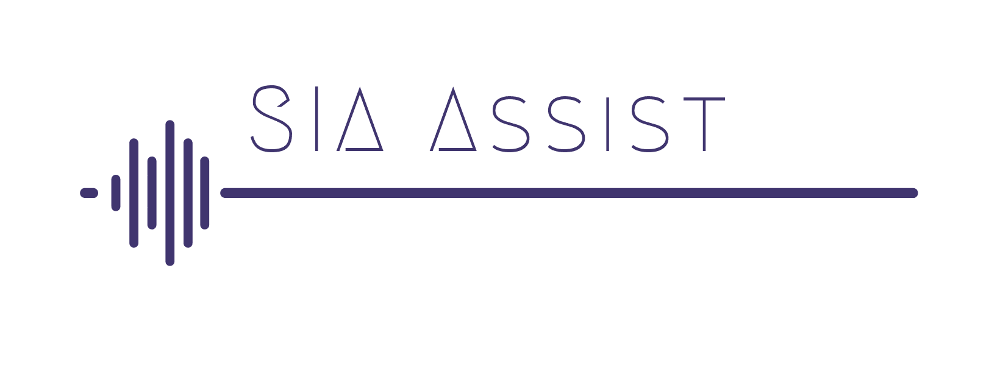
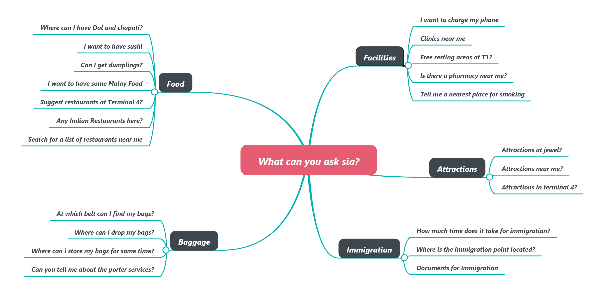

## SECTION 1 : PROJECT TITLE
### Sia Assist - Personal Airport Assistant

---
## SECTION 2 : EXECUTIVE SUMMARY

In this project, we designed an intelligent chatbot called ‘SIA Assist’, that
can be primarily used to obtain information on all aspects of Singapore’s Changi Airport.

Our proposed chatbot shows true effectiveness when the system has access to user’s travel
information so that his responses can be personalised - either by integrating the chatbot with
an airline application or obtaining his travel information in some other form.

---
## SECTION 3 : PROJECT CONTRIBUTION

| Full Name | Student ID |
| :------------ |:---------------:| 
| Akshay Sachdeva | A0198532W | 
| Aniket Mohan Arasanipalai | A0198481N |
| Srikar Namburu | A0198490N |
| Vishaag Suriyanarayanan | A0198504X | 

---
## SECTION 4 : VIDEO OF SYSTEM MODELLING & USE CASE DEMO

---
## SECTION 5 : USER GUIDE

[View SIA Assist User Guide](https://github.com/SrikarNamburu/siaAssist/blob/master/Project%20User%20Guide/SIA%20User%20Guide.pdf)

### Here are some things you can ask SIA!

---
## SECTION 6 : PROJECT REPORT / PAPER

[View Project Report](https://github.com/SrikarNamburu/siaAssist/blob/master/Project%20Report/SIA%20ASSIST%20Project%20Report.pdf)
